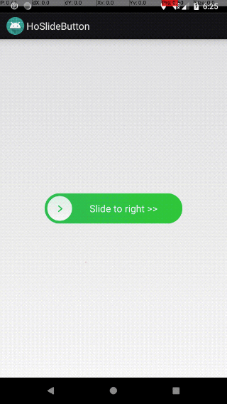

# HoSlideButton

Author : hosle

Created in 23rd Oct 2018


## Demo




## Usage

```
	fun setText(text:CharSequence){
    }

    fun setTextSize(size:Float){
    }

    fun setTextSize(unit :Int, size:Float){
    }

    fun setTextColor(@ColorInt resId:Int){
    }

    fun setTextStyle(tf:Typeface){
    }

    fun setGravity(gravity:Int){
    }
    
    // reset round icon to start position
    fun slideToStartPos(){
    }
    
    fun setOnClickListener{ 
    }
```


## License

Copyright (C) 2018. Henry Tam (hosle)

Contact: hosle@163.com

Licensed under the Apache License, Version 2.0 (the "License"); you may not use this file except in compliance with the License. You may obtain a copy of the License at

http://www.apache.org/licenses/LICENSE-2.0

Unless required by applicable law or agreed to in writing, software distributed under the License is distributed on an "AS IS" BASIS, WITHOUT WARRANTIES OR CONDITIONS OF ANY KIND, either express or implied. See the License for the specific language governing permissions and limitations under the License.

